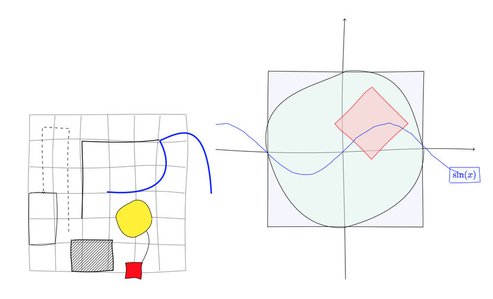

[](https://twitter.com/intent/tweet?text=Draw%20technical%20dimension%20lines%20with%20%23TikZ%20and%20%23LaTeX&tw_p=tweetbutton&via=renard_0)
[](https://twitter.com/intent/follow?region=follow_link&screen_name=renard_0&tw_p=followbutton)


# Hand drawing in TikZ

This work is based on
[simulating hand drawn lines](http://tex.stackexchange.com/questions/39296)
answer give on StackExchange.


## Installation

To install the `tkiz-penciline` package copy its directory to either to:

- `$TEXHOME/tex/latex/`
- `$TEXMFHOME/tex/latex/`
- `~/texmf/tex/latex/`
- `~/Library/texmf/tex/latex/`

## Usage

In a `tex` you can use by adding `penciline` property to any drawn item:


```tex
\begin{tikzpicture}[penciline={jag ratio=1}]
\draw[penciline={jag ratio=5},->](-5,0) -- (5,0); 
\draw[penciline={jag ratio=5},->](0,-5) -- (0,5); 

\draw[decorate,fill=blue!15,fill opacity=.25]  (-3,-3) rectangle (3,3);
\draw[penciline={jag ratio=0},fill=green!15,fill opacity=.25] circle [radius=3cm]; 
\draw[decorate,red,shift={(1,1)},rotate=45,fill=red!25,fill opacity=.5] %
          (1,1) -- (1,-1) -- (-1,-1) -- (-1,1) -- (1,1);
\draw[penciline={jag ratio=0.1},color=blue]   plot (\x,{sin(\x r)}) node [decorate,draw] {$\sin(x)$} ;     
\end{tikzpicture}
```



See [example file](tikz-penciline-example.tex) for further details.

See [documentation file](tikz-penciline-doc.pdf) for documentation.

## License

This program is free software. It comes without any warranty, to the extent
permitted by applicable law. You can redistribute it and/or modify it under
the terms of the Do What The Fuck You Want To Public License, Version 2, as
published by Sam Hocevar. See http://sam.zoy.org/wtfpl/COPYING for more
details.
